# Raspberry Pi Zero 2 W Setup Guide

This guide covers flashing and first-boot setup for both Pi Zero 2 W boards. It assumes you're setting up from a Mac.

## 🛒 Hardware Requirements

### Both Pis:
- **Raspberry Pi Zero 2 W** (2 units)
- **MicroSD Cards** (64GB+ recommended, Class 10 or higher)
- **Power Supplies** (5V/2.5A Micro USB)
- **WiFi router**

### Pi #1 (blink-drive) only:
- **USB-A to Micro USB cable** — to connect to the Blink Sync Module

## Step 1: Flash the MicroSD Card

Use [Raspberry Pi Imager](https://www.raspberrypi.com/software/) to flash each card.

1. **Choose Device** — Raspberry Pi Zero 2 W
   <div align="center">
      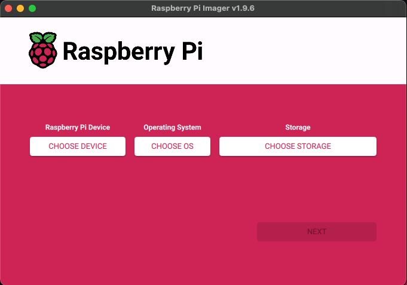
   </div>

1. **Choose OS** — Raspberry Pi OS (other) → **Raspberry Pi OS Lite (64-bit)**
   <div align="center">
      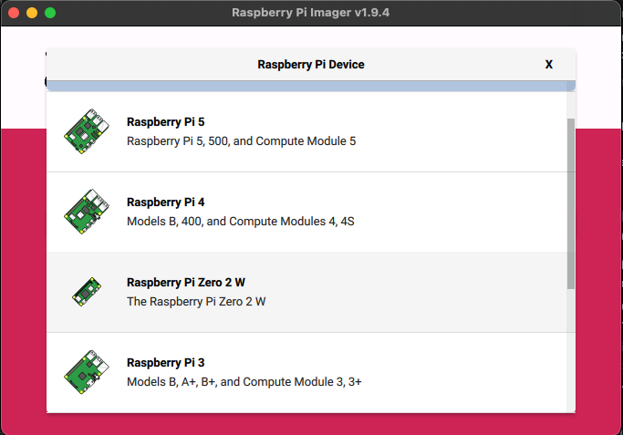
   </div>
   <div align="center">
      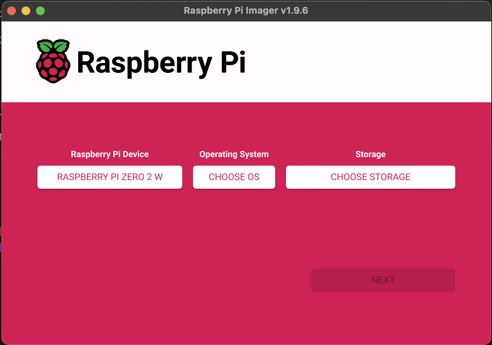
   </div>

1. **Choose Storage** — select your MicroSD card. This will erase the card.
   <div align="center">
      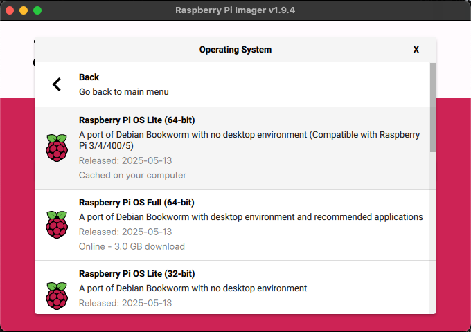
   </div>

1. **Set Hostname** — `blink-drive` for Pi #1, `blink-processor` for Pi #2
   <div align="center">
      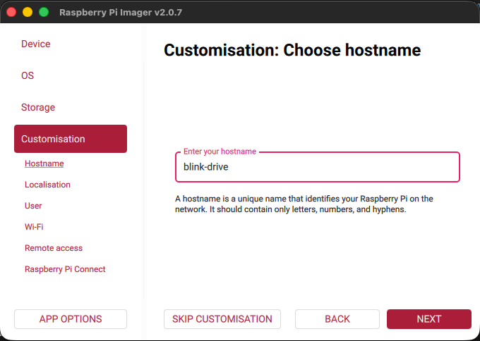
   </div>
   <div align="center">
      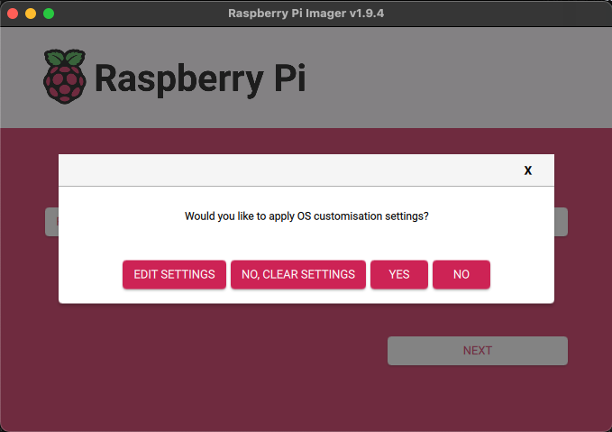
   </div>

1. **Set Username & Password**
   <div align="center">
      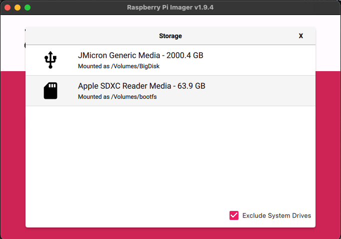
   </div>

1. **Set Wi-Fi Credentials**
   <div align="center">
      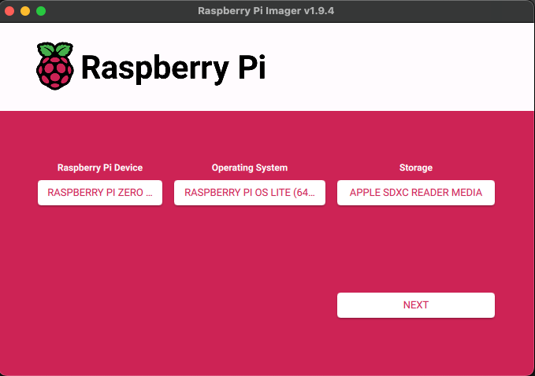
   </div>

1. **Enable SSH**
   <div align="center">
      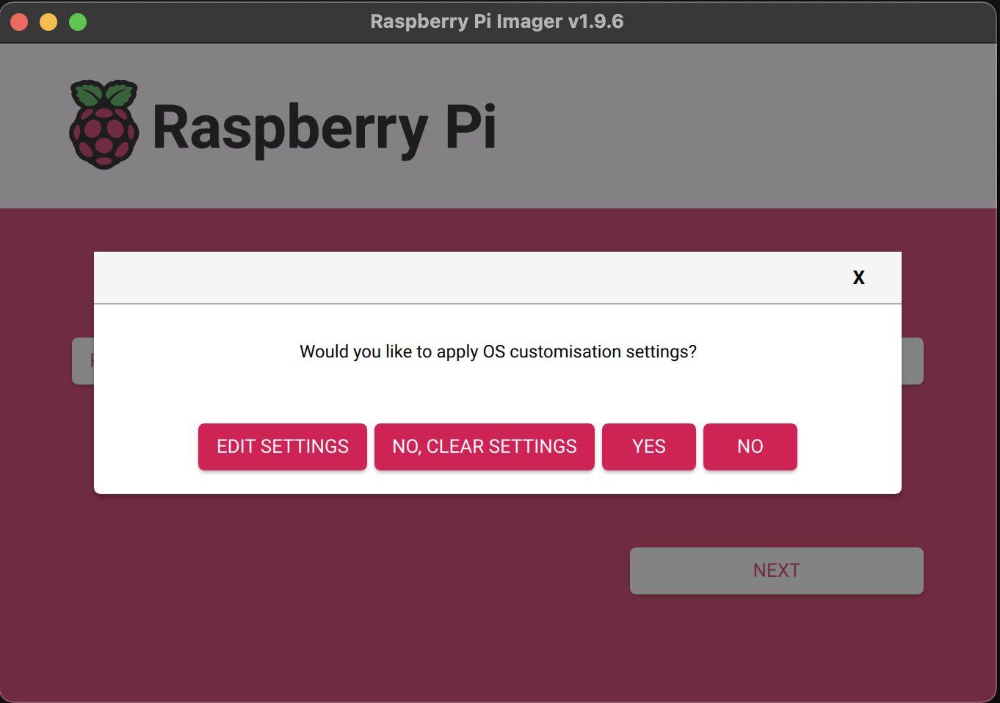
   </div>

1. **Raspberry Pi Connect** — skip this, not needed
   <div align="center">
      
   </div>

1. **Write** — click WRITE, confirm the warning, wait for it to complete
   <div align="center">
      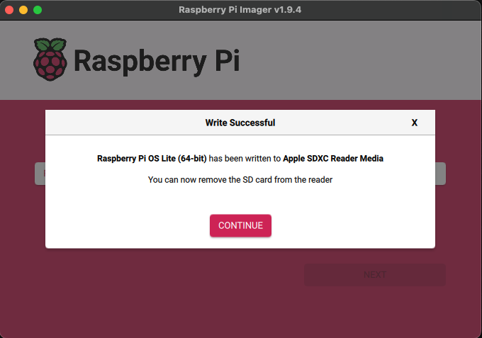
   </div>
   <div align="center">
      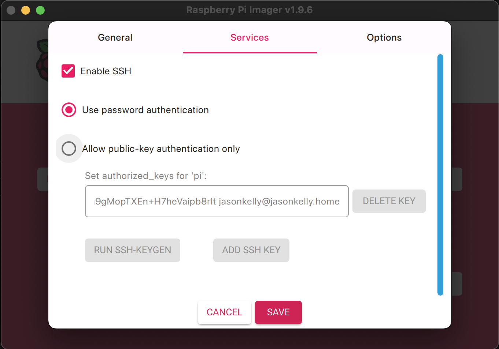
   </div>
   <div align="center">
      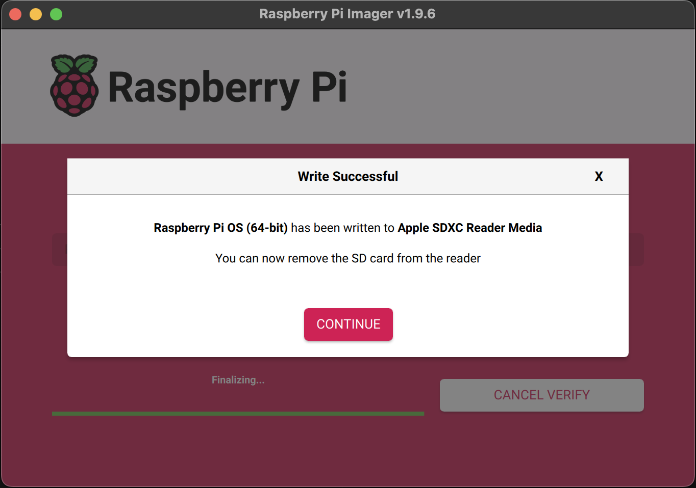
   </div>

### If the Pi fails to connect to Wi-Fi

The Raspberry Pi Imager sometimes writes the Wi-Fi password as a WPA-PSK hash that NetworkManager fails to parse, causing a silent connection failure. To fix it, remove and reinsert the SD card on your Mac and edit the network config:

```bash
vim /Volumes/bootfs/network-config
```

Find the `access-points` section and replace the hashed password with your plaintext password:

```yaml
access-points:
  "Your Network Name":
    password: "YOUR_PLAINTEXT_PASSWORD"
```

> **Note:** This stores your Wi-Fi password in plaintext on the SD card — acceptable for a home network but be aware if the card could be accessed by others.

## Step 2: First Boot

Insert the SD card, power on the Pi, and wait a minute or two for the LED to stop flashing. Then SSH in:

```bash
# Pi #1
ssh pi@blink-drive.local

# Pi #2
ssh pi@blink-processor.local
```

> Raspberry Pi OS automatically expands the filesystem to fill the SD card on first boot. No manual action needed.

Repeat for the second Pi.

## Next Steps

Once both Pis are accessible via SSH, proceed to the [Application Setup Guide](blink-app-setup.md).

## 📚 Additional Resources

- [Raspberry Pi Official Documentation](https://www.raspberrypi.org/documentation/)
- [USB Gadget Mode Documentation](https://www.kernel.org/doc/html/latest/usb/gadget.html)
- [face_recognition library](https://github.com/ageitgey/face_recognition)

---

*For application setup and troubleshooting, see the [Application Setup Guide](blink-app-setup.md).*
