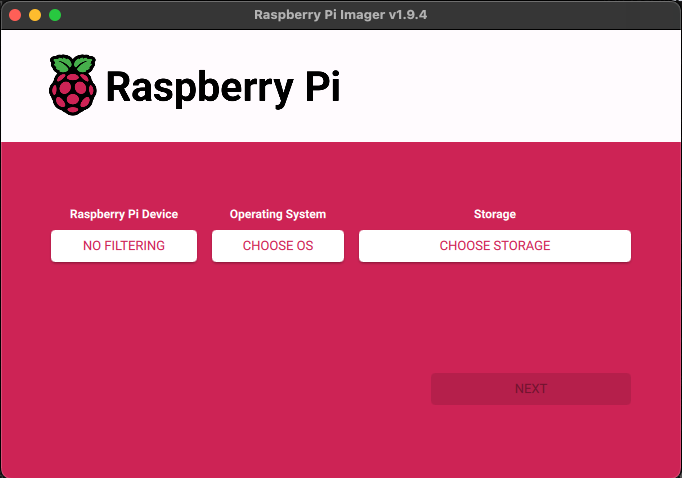
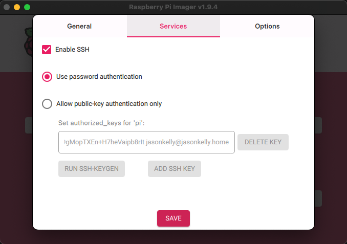
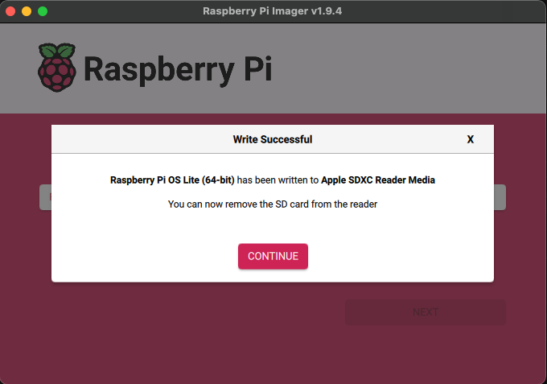

# Raspberry Pi Zero 2 W Setup Guide

This guide provides detailed instructions for setting up a headless Raspberry Pi Zero 2 W board for the Blink Sync Brain system.

**Note**: This guide assumes you're setting up from a Mac and that the Pi boards use NetworkManager for network configuration (default in recent Raspberry Pi OS versions).


## 🛒 Hardware Requirements

### For Both Pi Zero 2 W Boards:
- **WiFi router** (for network connectivity)
- **Raspberry Pi Zero 2 W** (2 units)
- **MicroSD Cards** (64GB+ recommended, Class 10 or higher)
- **Power Supplies** (5V/2.5A Micro USB power supplies)
- **USB-A to Micro USB cables** (optional, for keyboard)
- **Micro HDMI to HDMI cables** (optional, for monitor)
- **USB keyboard** (optional)

### Additional for blink-usb (Pi #1 — USB Gadget):
- **USB-A to Micro USB cable** (to connect to Blink Sync Module)

### Additional for blink-processor (Pi #2 — Video Processing):
- **External storage** (optional, for additional video storage)

<!-- TODO: Update screenshots and instructions to match the latest Raspberry Pi Imager version -->

## ✨ Pi Zero 2 W Setup (both USB Gadget and Video Processing PIs)

### Step 1: Prepare the MicroSD Card (from your Mac)

1. **Download Raspberry Pi OS Lite**
   ```bash
   # Download the latest Raspberry Pi OS Lite image
   curl -O https://downloads.raspberrypi.org/raspios_lite_arm64/images/raspios_lite_arm64-2025-12-04/2025-12-04-raspios-trixie-arm64-lite.img.xz
   
   # Extract the image
   xz -d 2025-12-04-raspios-trixie-arm64-lite.img.xz
   ```

   Once extracted, open the app from Finder.

1. **Choose the Device**

   Choose 'Raspberry Pi Zero 2 W' from the list of devices.
   <div align="center">
      
   </div>

1. **Choose the OS to install**

   For our purposes we do not want to install the default Raspberry Pi OS. We want to go for something lighter. Select 'Raspberry Pi OS (other)'.
   <div align="center">
      
   </div>
   Select 'Raspberry Pi OS Lite (64-bit)'. Make sure to select the 'no desktop' version. This is a headless installation.
   <div align="center">
      
   </div>

1. **Identify and Flash the MicroSD Card**

   Select the storage device you wish to format.
   **Note:** Choose carefully as this process will erase the selected drive.
   <div align="center">
      
   </div>

1. **Set Hostname & Localisation**

   Here you can set the hostname (`blink-usb` for Pi #1, `blink-processor` for Pi #2).
   <div align="center">
      
   </div>
   <div align="center">
      
   </div>

1. **Set Username & Password**
   <div align="center">
      
   </div>
   
1. **Set Wi-Fi Credentials**
   <div align="center">
      
   </div>
   
1. **Enable SSH**
   <div align="center">
      
   </div>
   
1. **Raspberry Pi Connect**
 
   No need to enable Pi Connect. 
   <div align="center">
      
   </div>
   
1. **Write Image**

   Review the settings and click 'WRITE'
   <div align="center">
      
   </div>
   You will be shown a warning at this point. Go ahead and click 'I UNDERSTAND, ERASE AND WRITE'
   <div align="center">
      
   </div>

1. **Done!**

   Once the process is complete you will see the 'Write complete!' screen.
   Click 'FINISH'.
   <div align="center">
      
   </div>

1. **Fix WiFi configuration (if Pi fails to connect)**

   If your Pi doesn't connect to Wi-Fi on first boot, this is likely the cause. The Raspberry Pi Imager writes Wi-Fi credentials to a cloud-init network config file on the boot partition, converting your password into a WPA-PSK hash (a 64-character hex string). Some OS/NetworkManager versions don't correctly translate this hash, causing silent connection failures.

   To fix it, remove and reinsert the Micro SD card, then open the network config:
   ```
   vim /Volumes/bootfs/network-config
   ```

   Find the `access-points` section:
   ```yaml
   access-points:
     "Your Network Name":
       password: "55979980be566daa24018c3ff678eac0e6d71c317cf60f75dcd451f822267ab9"
   ```

   Replace the hashed password with your plaintext password:
   ```yaml
   access-points:
     "Your Network Name":
       password: "YOUR_PLAINTEXT_PASSWORD"
   ```

   **Note:** This stores your Wi-Fi password in plaintext on the SD card. This is acceptable for a headless Pi on a home network, but be aware if your SD card could be accessed by others.

   Eject and remove the SD card from your Mac.
   

### Step 2: Initial Pi Setup

1. **SSH into your Pi**

   Insert the Micro SD card in to your Pi and power it up. Wait a couple of minutes for the LED to stop flashing. At this point you can SSH into the pi using the hostname.
   ```
   ssh pi@blink-usb.local
   ```

   **Note:** Raspberry Pi OS automatically expands the filesystem to use the full SD card on first boot. No manual expansion is needed.

1. **Repeat**

   Repeat the steps in this section for the Raspberry Pi 2 W Processor, using the hostname `blink-processor`.

## Next Steps

Once both Pis are running and accessible via SSH, proceed to the [Application Setup Guide](blink-app-setup.md) to configure:

- **blink-usb (Pi #1)** — USB gadget mode, virtual storage, and systemd service
- **blink-processor (Pi #2)** — Video processing dependencies, face recognition, and systemd service

## 📚 Additional Resources

- [Raspberry Pi Official Documentation](https://www.raspberrypi.org/documentation/)
- [USB Gadget Mode Documentation](https://www.kernel.org/doc/html/latest/usb/gadget.html)
- [OpenCV Installation Guide](https://docs.opencv.org/master/d2/de6/tutorial_py_setup_in_ubuntu.html)
- [Face Recognition Documentation](https://github.com/ageitgey/face_recognition)

---

*For application setup and troubleshooting, see the [Application Setup Guide](blink-app-setup.md) or create an issue on the project repository.* 