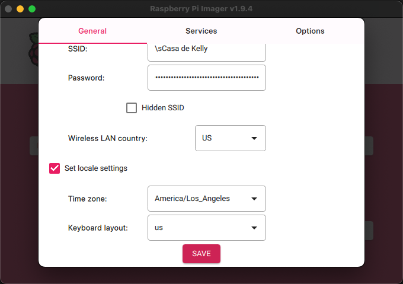

# Raspberry Pi Zero 2 W Setup Guide

This guide provides detailed instructions for setting up both Raspberry Pi Zero 2 W boards for the Blink Sync Brain system.

**Note**: This guide assumes you're setting up from a Mac and that the Pi boards use NetworkManager for network configuration (default in recent Raspberry Pi OS versions).

## 📋 Overview

The Blink Sync Brain system uses two Raspberry Pi Zero 2 W boards:

- **Pi Zero 2 W Drive**: USB Gadget Mode - Acts as virtual USB storage for Blink Sync Module
- **Pi Zero 2 W Processor**: Video Processing Hub - Handles video analysis and face recognition

## 🛒 Hardware Requirements

### For Both Pi Zero 2 W Boards:
- **WiFi router** (for network connectivity)
- **Raspberry Pi Zero 2 W** (2 units)
- **MicroSD Cards** (64GB+ recommended, Class 10 or higher)
- **Power Supplies** (5V/2.5A Micro USB power supplies)
- **USB-A to Micro USB cables** (optional, for keyboard)
- **Micro HDMI to HDMI cables** (optional, for monitor)
- **USB keyboard** (optional)

### Additional for Pi Zero 2 W Storage:
- **USB-A to Micro USB cable** (to connect to Blink Sync Module)

### Additional for Pi Zero 2 W Processor:
- **External storage** (optional, for additional video storage)

## ✨ Pi Zero 2 W Setup (both USB Gadget and Video Processing PIs)

### Step 1: Prepare the MicroSD Card (from your Mac)

1. **Download Raspberry Pi OS Lite**
   ```bash
   # Download the latest Raspberry Pi OS Lite image
   curl -O https://downloads.raspberrypi.org/raspios_lite_arm64/images/raspios_lite_arm64-2023-12-11/2023-12-11-raspios-bookworm-arm64-lite.img.xz
   
   # Extract the image
   xz -d 2023-12-11-raspios-bookworm-arm64-lite.img.xz
   ```

   Once extracted, open the app from Finder.

1. **Choose the Device**

   Click 'NO FILTERING'.
   <div align="center">
      
   </div>
   'Choose the 'Raspberry Pi Zero 2 W'.
   <div align="center">
   
   </div>

1. **Choose the OS to install**

   Click 'CHOOSE OS'.
   <div align="center">
      
   </div>
   For our purposes we do not want to install the default Raspberry Pi OS. We want to go for something lighter. Select 'Raspberry Pi OS (other)'
   <div align="center">
      
   </div>
   Select 'Raspberry Pi OS Lite (64-bit)'. Make sure to select the 'no desktop' version. This is a headless installation.
   <div align="center">
      
   </div>


1. **Identify and Flash the MicroSD Card**

   Click 'CHOOSE STORAGE'.
   <div align="center">
      
   </div>
   Select the storage device you with to format.
   
   **Note:** Choose carefully as this process will erase the selected drive.
   <div align="center">
      
   </div>

1. **Customize Settings**

   Click 'EDIT SETTINGS'.
   <div align="center">
      
   </div>
   Under the 'General' tab set the hostname, username and password, Wifi settings and locale.
   <div align="center">
      
   </div>
   <div align="center">
      
   </div>
   Select the 'Services' tab and click 'Enable SSH' and 'Use password authentication'.
   <div align="center">
      
   </div>
   Click 'Save'.

1. **Write the OS to the SD Card**

   You are now back at the main screen. Click 'Next'. This will begin the process of overwriting your Micro SD card with the Raspberry Pi OS. 
   <div align="center">
      
   </div>
   Once the 'Write Successful' popup is displayed click 'CONTINUE'. You can now remove the SD card from your Mac.
   <div align="center">
      
   </div>
   
1. **Fix WiFi configuration**

   Remove and reinsert the Micro SD card. From the command line edit the ```firstrun.sh``` file.
   ```
   vim /Volumes/bootfs/firstrun.sh
   ```

   Search for your WiFi SSID. There will be two locations. In my case it's 
   ```
   /usr/lib/raspberrypi-sys-mods/imager_custom set_wlan '\sCasa de Kelly' 'dfa1a78e9fef75e6da63a65b66992a36f7f4a7a64fbba95383f1fcd7840f9739' 'US'

   ...

   network={
        ssid="\sCasa de Kelly"
        psk=dfa1a78e9fef75e6da63a65b66992a36f7f4a7a64fbba95383f1fcd7840f9739
   }
   ```

   Replace the hashed password with your plain text password.
   ```
   /usr/lib/raspberrypi-sys-mods/imager_custom set_wlan '\sCasa de Kelly' '<YOUR PASSWORD>' 'US'

   ...

   network={
        ssid="\sCasa de Kelly"
        psk="<YOUR PASSWORD>"
   }
   ```

   Remove the SD Card from your Mac.
   

### Step 2: Initial Pi Setup

1. **SSH into your Pi**

   Insert the Micro SD card in to your Pi and power it up. Wait a couple of minutes for the LED to stop flashing. Now remove the power cable and reinsert it. This reboot process is required for the hostname to register. At this point you can SSH into the pi using the hostname.
   ```
   ssh pi@braindrive.local
   ```

1. **Repeat**

   Repeat the steps in this section for the Raspberry Pi 2 W Processor. 

## ✨ Configure USB Gadget Mode for Brain Drive

Brain Drive emulates a USB Flash Drive for the Blink Module. It is controlled by Brain Processor and switches between "Storage Mode" (for Blink) and "Server Mode" (for Brain Processor).

1. **Connect to the Pi**

   SSH into the Brain Drive that will be used as a USB drive.
   ```bash
   ssh pi@braindrive.local
   ```

1. **Update the System**
   ```bash
   sudo apt update && sudo apt upgrade -y
   sudo apt install -y git python3 python3-pip
   sudo apt install -y screen
   ```

1. **Install the Blink Sync Brain application**
   ```bash
   cd /opt
   sudo git clone https://github.com/highhair20/blink-sync-brain.git
   ```

1. **Install & Configure Samba (for Server Mode)**
   ```bash
   sudo apt install samba -y
   # Create the directory that will be shared
   mkdir /home/pi/blink_share
   # Edit the Samba config file
   sudo nano /etc/samba/smb.conf
   ```

   Add this share definition to the very bottom of the file:
   ```bash
   [BlinkClips]
   comment = Blink Video Clips
   path = /home/pi/blink_share
   read only = no
   browsable = yes
   guest ok = yes
   ```

   Save the file and restart Samba: ```sudo systemctl restart smbd```.

1. **Create the Virtual Storage**

   Create the large file that will act as the flash drive's storage. This will take some time so running it in a screen will help in case your ssh session gets interupted.
   ```bash
   screen
   dd if=/dev/zero of=/home/pi/brain_drive.img bs=1M count=32768 status=progress
   # Format the file with the FAT32 filesystem
   sudo mkfs.vfat /home/pi/brain_drive.img
   ```

1. **Enable USB Gadget Mode**
   ```bash
   sudo nano /boot/firmware/config.txt
   ```
   Append the following to the bottom of the file:
   ```bash
   dtoverlay=dwc2
   ```
   A reboot is needed for this to take effect: 
   ```bash
   sudo reboot
   ```


---

1. **Enable USB Gadget Modules**
   ```bash
   # Edit modules
   sudo nano /etc/modules
   ```

   Add these lines:
   ```conf
   dwc2
   g_mass_storage
   ```

1. **Install USB Gadget Script**
   ```bash
   sudo mkdir -p /opt/blink-sync-brain
   sudo cp /opt/blink-sync-brain-repo/scripts/drive/usb-gadget.sh /opt/blink-sync-brain/usb-gadget.sh
   sudo chmod +x /opt/blink-sync-brain/usb-gadget.sh
   ```

5. **Make the Script Executable**
   ```bash
   sudo chmod +x /opt/blink-sync-brain/usb-gadget.sh
   ```

6. **Create Systemd Service**
   ```bash
   sudo cp /opt/blink-sync-brain-repo/scripts/systemd/blink-drive.service /etc/systemd/system/
   ```

   The service will invoke `blink-drive start` using `/etc/blink-sync-brain/config.yaml`.

7. **Enable and Start the Service**
   ```bash
   sudo systemctl enable --now blink-drive
   ```

8. **Reboot**
  ```bash
  sudo reboot
  ```

<!--
### Step 4: Install Blink Sync Brain
1. **Clone the Repository**
   ```bash
   cd /opt
   sudo git clone https://github.com/yourusername/blink-sync-brain.git
   cd blink-sync-brain
   ```

2. **Install Dependencies**
   ```bash
   sudo pip3 install -r requirements.txt
   ```

3. **Create Configuration**
   ```bash
   sudo cp config.yaml.example /etc/blink-sync-brain/config.yaml
   sudo nano /etc/blink-sync-brain/config.yaml
   ```
-->

4. **Setup Storage Directory**
   ```bash
   sudo mkdir -p /var/blink_storage
   sudo chown pi:pi /var/blink_storage
   ```

5. **Install Python role and Test USB Gadget Mode**
   ```bash
   # Install minimal role
   pip install .[drive]
   sudo mkdir -p /etc/blink-sync-brain
   sudo cp configs/drive.yaml /etc/blink-sync-brain/config.yaml

   # Check if the gadget is active
   ls /sys/kernel/config/usb_gadget/blink_storage/
   
   # Check if the virtual drive exists
   ls -la /var/blink_storage/
   ```

## ✨ Pi Zero 2 W #2: Video Processing Setup

### Step 1: Install Video Processing Dependencies

1. **Update the System**
   ```bash
   sudo apt update && sudo apt upgrade -y
   sudo apt install -y git python3 python3-pip
   ```

2. **Install System Dependencies**
   ```bash
   # Install video processing dependencies
   sudo apt install -y ffmpeg libsm6 libxext6 libxrender-dev libgomp1
   
   # Install OpenCV dependencies
   sudo apt install -y libatlas-base-dev libhdf5-dev libhdf5-serial-dev
   sudo apt install -y libjasper-dev libqtcore4 libqtgui4 libqt4-test
   sudo apt install -y libavcodec-dev libavformat-dev libswscale-dev
   sudo apt install -y libv4l-dev libxvidcore-dev libx264-dev
   sudo apt install -y libgtk-3-dev libtiff5-dev libjpeg-dev libpng-dev
   sudo apt install -y libtiff-dev libdc1394-22-dev
   ```

3. **Install Python Dependencies**
   ```bash
   # Install face recognition dependencies
   sudo apt install -y cmake build-essential
   sudo apt install -y libdlib-dev libblas-dev liblapack-dev
   sudo apt install -y libjpeg-dev libpng-dev libtiff-dev
   sudo apt install -y libavcodec-dev libavformat-dev libswscale-dev
   sudo apt install -y libv4l-dev libxvidcore-dev libx264-dev
   sudo apt install -y libgtk-3-dev libatlas-base-dev gfortran
   ```

### Step 4: Install Blink Sync Brain (Pi #2 Processor)

1. **Clone the Repository**
   ```bash
   cd /opt
   sudo git clone https://github.com/yourusername/blink-sync-brain.git
   cd blink-sync-brain
   ```

2. **Install Python Dependencies**
   ```bash
   pip install .[processor]
   ```

3. **Create Configuration**
   ```bash
   sudo cp config.yaml.example /etc/blink-sync-brain/config.yaml
   sudo nano /etc/blink-sync-brain/config.yaml
   ```

   Update the configuration for video processing:
   ```yaml
   storage:
     video_directory: "/var/blink_storage/videos"
     results_directory: "/var/blink_storage/results"
   
   processing:
     frame_skip: 3  # Lower for better accuracy
     max_concurrent_videos: 1  # Lower for Pi Zero 2 W
   
   face_recognition:
     database_path: "/var/blink_storage/face_database.pkl"
     confidence_threshold: 0.7  # Higher for better accuracy
   ```

4. **Setup Storage Directory**
   ```bash
   sudo mkdir -p /var/blink_storage/videos
   sudo mkdir -p /var/blink_storage/results
   sudo chown pi:pi /var/blink_storage
   ```

### Step 5: Configure Network Access

1. **Setup Static IP using NetworkManager**
   ```bash
   # Connect to the Pi via SSH first
   ssh pi@192.168.1.XXX
   
   # Configure static IP using NetworkManager
   sudo nmcli connection modify "Wi-Fi" ipv4.addresses "192.168.1.201/24"
   sudo nmcli connection modify "Wi-Fi" ipv4.gateway "192.168.1.1"
   sudo nmcli connection modify "Wi-Fi" ipv4.dns "192.168.1.1,8.8.8.8"
   sudo nmcli connection modify "Wi-Fi" ipv4.method "manual"
   
   # Restart the connection
   sudo nmcli connection down "Wi-Fi"
   sudo nmcli connection up "Wi-Fi"
   ```

2. **Enable SSH Access from Pi #1**
   ```bash
   # On Pi #2, generate SSH key
   ssh-keygen -t rsa -b 4096
   
   # Copy public key to Pi #1
   ssh-copy-id pi@192.168.1.200
   ```

### Step 6: Setup Face Recognition Database

1. **Create Face Database**
   ```bash
   # Create directory for face images
   mkdir -p ~/face_images
   
   # Add known faces (place face images in the directory)
   # Image names should be: person_name.jpg
   
   # Setup the face database
   blink-sync-brain setup face-database
   ```

2. **Test Face Recognition**
   ```bash
   # Test with a sample video
   blink-processor process-video /path/to/test_video.mp4 --output-dir /var/blink_storage/results
   ```

## 🔧 System Integration

### Step 1: Connect Pi #1 to Blink Sync Module

1. **Connect USB Cable**
   - Connect Pi #1 to Blink Sync Module using USB-A to USB-A cable
   - Power on Pi #1
   - Wait for USB gadget to initialize

2. **Configure Blink Sync Module**
   - In Blink app, go to Sync Module settings
   - Select "Local Storage"
   - Choose the USB drive (should appear as "Blink Storage Device")

### Step 2: Setup Network Communication

1. **Configure Pi #1 to Access Pi #2**
   ```bash
   # On Pi #1, test connection to Pi #2
   ping 192.168.1.201
   
   # Setup SSH key for passwordless access
   ssh-keygen -t rsa -b 4096
   ssh-copy-id pi@192.168.1.201
   ```

2. **Test Video Transfer**
   ```bash
   # On Pi #2, create a test script
   nano ~/test_transfer.sh
   ```

   Add this script:
   ```bash
   #!/bin/bash
   
   # Monitor for new videos and process them
   while true; do
       for video in /var/blink_storage/videos/*.mp4; do
           if [ -f "$video" ]; then
               echo "Processing: $video"
                blink-processor process-video "$video"
               mv "$video" /var/blink_storage/processed/
           fi
       done
       sleep 10
   done
   ```

## 🚨 Troubleshooting

### USB Gadget Issues

1. **Gadget Not Recognized**
   ```bash
   # Check if modules are loaded
   lsmod | grep dwc2
   lsmod | grep g_mass_storage
   
   # Reload modules if needed
   sudo modprobe dwc2
   sudo modprobe g_mass_storage
   ```

2. **Virtual Drive Not Created**
   ```bash
   # Check if the drive file exists
   ls -la /var/blink_storage/
   
   # Create manually if needed
   sudo dd if=/dev/zero of=/var/blink_storage/virtual_drive.img bs=1G count=32
   sudo mkfs.exfat /var/blink_storage/virtual_drive.img
   ```

### Video Processing Issues

1. **OpenCV Installation Problems**
   ```bash
   # Install OpenCV from source if pip fails
   sudo apt install -y python3-opencv
   ```

2. **Face Recognition Issues**
   ```bash
   # Check dlib installation
   python3 -c "import dlib; print('dlib OK')"
   
   # Reinstall if needed
   sudo pip3 uninstall dlib face_recognition
   sudo pip3 install dlib face_recognition
   ```

3. **Performance Issues**
   ```bash
   # Monitor system resources
   htop
   
   # Check temperature
   vcgencmd measure_temp
   
   # Reduce processing load
   # Edit config.yaml and increase frame_skip
   ```

### Network Issues

1. **Pi #2 Not Accessible**
   ```bash
   # Check network configuration using NetworkManager
   nmcli device status
   nmcli connection show
   
   # Check IP address
   ip addr show wlan0
   
   # Test connectivity
   ping 192.168.1.1
   ping 8.8.8.8
   ```

2. **NetworkManager Configuration Issues**
   ```bash
   # Check NetworkManager service status
   sudo systemctl status NetworkManager
   
   # Restart NetworkManager
   sudo systemctl restart NetworkManager
   
   # List available WiFi networks
   nmcli device wifi list
   
   # Connect to a specific network
   sudo nmcli device wifi connect "SSID_NAME" password "PASSWORD"
   
   # Check connection details
   nmcli connection show "Wi-Fi"
   ```

2. **SSH Connection Issues**
   ```bash
   # Check SSH service
   sudo systemctl status ssh
   
   # Restart SSH if needed
   sudo systemctl restart ssh
   
   # Check NetworkManager connection
   nmcli connection show "Wi-Fi"
   nmcli device wifi list
   ```

## 📊 Monitoring and Maintenance

### System Monitoring

1. **Create Monitoring Script**
   ```bash
   nano ~/monitor_system.sh
   ```

   Add this script:
   ```bash
   #!/bin/bash
   
   echo "=== Blink Sync Brain System Status ==="
   echo "Date: $(date)"
   echo
   
   echo "Pi #1 (USB Gadget):"
   ssh pi@192.168.1.200 "blink-sync-brain status"
   echo
   
   echo "Pi #2 (Video Processing):"
   blink-sync-brain status
   echo
   
   echo "Storage Usage:"
   df -h /var/blink_storage
   echo
   
   echo "Temperature:"
   vcgencmd measure_temp
   ```

2. **Setup Cron Job for Monitoring**
   ```bash
   crontab -e
   ```

   Add this line:
   ```cron
   */30 * * * * /home/pi/monitor_system.sh >> /var/log/blink_monitor.log 2>&1
   ```

### Regular Maintenance

1. **Weekly Tasks**
   ```bash
   # Update system
   sudo apt update && sudo apt upgrade
   
   # Clean old logs
   sudo journalctl --vacuum-time=7d
   
   # Check disk usage
   df -h
   ```

2. **Monthly Tasks**
   ```bash
   # Backup face database
   cp /var/blink_storage/face_database.pkl /backup/
   
   # Clean old videos
   blink-sync-brain cleanup --dry-run
   blink-sync-brain cleanup
   ```

## 🔒 Security Considerations

1. **Change Default Passwords**
   ```bash
   # Change pi user password
   passwd
   
   # Create new user (optional)
   sudo adduser blinkuser
   sudo usermod -aG sudo blinkuser
   ```

2. **Firewall Configuration**
   ```bash
   # Install and configure firewall
   sudo apt install -y ufw
   sudo ufw allow ssh
   sudo ufw allow 8080  # If using web interface
   sudo ufw enable
   ```

3. **Regular Updates**
   ```bash
   # Setup automatic security updates
   sudo apt install -y unattended-upgrades
   sudo dpkg-reconfigure unattended-upgrades
   ```

## 📚 Additional Resources

- [Raspberry Pi Official Documentation](https://www.raspberrypi.org/documentation/)
- [USB Gadget Mode Documentation](https://www.kernel.org/doc/html/latest/usb/gadget.html)
- [OpenCV Installation Guide](https://docs.opencv.org/master/d2/de6/tutorial_py_setup_in_ubuntu.html)
- [Face Recognition Documentation](https://github.com/ageitgey/face_recognition)

---

*For additional support, see the [Troubleshooting Guide](../troubleshooting/README.md) or create an issue on the project repository.* 