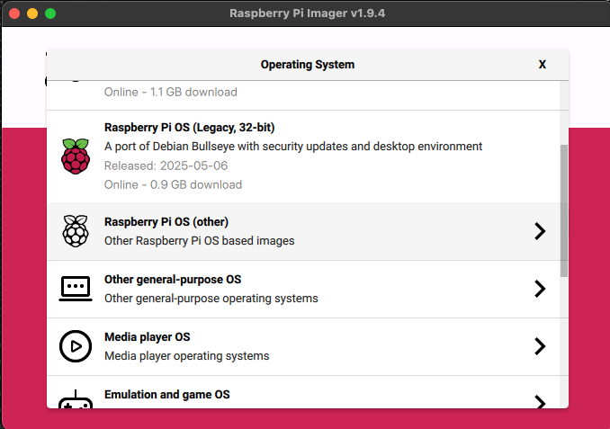
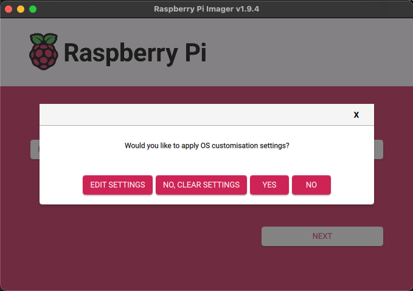
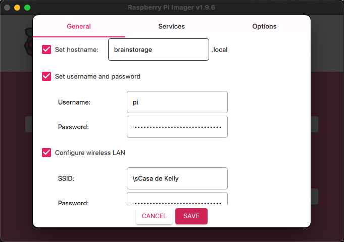

# Raspberry Pi Zero 2 W Setup Guide

This guide provides detailed instructions for setting up a headless Raspberry Pi Zero 2 W board for the Blink Sync Brain system.

**Note**: This guide assumes you're setting up from a Mac and that the Pi boards use NetworkManager for network configuration (default in recent Raspberry Pi OS versions).


## 🛒 Hardware Requirements

### For Both Pi Zero 2 W Boards:
- **WiFi router** (for network connectivity)
- **Raspberry Pi Zero 2 W** (2 units)
- **MicroSD Cards** (64GB+ recommended, Class 10 or higher)
- **Power Supplies** (5V/2.5A Micro USB power supplies)
- **USB-A to Micro USB cables** (optional, for keyboard)
- **Micro HDMI to HDMI cables** (optional, for monitor)
- **USB keyboard** (optional)

### Additional for Pi Zero 2 W Storage:
- **USB-A to Micro USB cable** (to connect to Blink Sync Module)

### Additional for Pi Zero 2 W Processor:
- **External storage** (optional, for additional video storage)

## ✨ Pi Zero 2 W Setup (both USB Gadget and Video Processing PIs)

### Step 1: Prepare the MicroSD Card (from your Mac)

1. **Download Raspberry Pi OS Lite**
   ```bash
   # Download the latest Raspberry Pi OS Lite image
   curl -O https://downloads.raspberrypi.org/raspios_lite_arm64/images/raspios_lite_arm64-2023-12-11/2023-12-11-raspios-bookworm-arm64-lite.img.xz
   
   # Extract the image
   xz -d 2023-12-11-raspios-bookworm-arm64-lite.img.xz
   ```

   Once extracted, open the app from Finder.

1. **Choose the Device**

   Click 'CHOOSE DEVICE'.
   <div align="center">
      
   </div>
   'Choose the 'Raspberry Pi Zero 2 W'.
   <div align="center">
   
   </div>

1. **Choose the OS to install**

   Click 'CHOOSE OS'.
   <div align="center">
      
   </div>
   For our purposes we do not want to install the default Raspberry Pi OS. We want to go for something lighter. Select 'Raspberry Pi OS (other)'
   <div align="center">
      
   </div>
   Select 'Raspberry Pi OS Lite (64-bit)'. Make sure to select the 'no desktop' version. This is a headless installation.
   <div align="center">
      
   </div>


1. **Identify and Flash the MicroSD Card**

   Click 'CHOOSE STORAGE'.
   <div align="center">
      
   </div>
   Select the storage device you with to format.
   
   **Note:** Choose carefully as this process will erase the selected drive.
   <div align="center">
      
   </div>

1. **Customize Settings**

   Click 'NEXT'.
   <div align="center">
      
   </div>

   Click 'EDIT SETTINGS'.
   <div align="center">
      
   </div>
   Under the 'General' tab set the hostname, username and password, Wifi settings and locale.
   <div align="center">
      
   </div>
   <div align="center">
      
   </div>
   Select the 'Services' tab and click 'Enable SSH' and 'Use password authentication'.
   <div align="center">
      
   </div>

   Click 'Save'.

1. **Write the OS to the SD Card**
   You should not see the popup asking "Would you like to apply OS customization settings?" Click "YES" and then "YES" again at the following Warning screen.
   <div align="center">
      
   </div>

   You are now back at the main screen. Click 'Next'. This will begin the process of overwriting your Micro SD card with the Raspberry Pi OS. 
   Once the 'Write Successful' popup is displayed click 'CONTINUE'. 
   <div align="center">
      
   </div>
   You can now remove the SD card from your Mac.

   

1. **Fix WiFi configuration**

   Remove and reinsert the Micro SD card. The Raspberry Pi Imager writes WiFi credentials to a cloud-init network config file. The password is stored as a hashed PSK which can cause connection failures. Open the file and replace it with your plaintext password:
   ```
   vim /Volumes/bootfs/network-config
   ```

   Find the `access-points` section:
   ```yaml
   access-points:
     "Casa de Kelly":
       password: "55979980be566daa24018c3ff678eac0e6d71c317cf60f75dcd451f822267ab9"
   ```

   Replace the hashed password with your plaintext password:
   ```yaml
   access-points:
     "Casa de Kelly":
       password: "YOUR_PLAINTEXT_PASSWORD"
   ```

   Eject and remove the SD card from your Mac.
   

### Step 2: Initial Pi Setup

1. **SSH into your Pi**

   Insert the Micro SD card in to your Pi and power it up. Wait a couple of minutes for the LED to stop flashing. Now remove the power cable and reinsert it. This reboot process is required for the hostname to register. At this point you can SSH into the pi using the hostname.
   ```
   ssh pi@braindrive.local
   ```

1. **Reclaim the full SSD capacity**
   
   The Raspberry Pi Imager tool copies a partition image of a fixed size, leaving the rest of the SSD as unallocated space. In our case we have a 64GB SSD card. To verify that the full capacity of the SSD is not available plug the card reader into your computer and run the following:

   ```
   sudo raspi-config
   ```
   Go to Advanced Options and select Expand Filesystem.
   Follow the on-screen instructions to expand the partition to use all available space.
   Reboot your Raspberry Pi when prompted.


1. **Repeat**

   Repeat the steps in this section for the Raspberry Pi 2 W Processor. 


## 📚 Additional Resources

- [Raspberry Pi Official Documentation](https://www.raspberrypi.org/documentation/)
- [USB Gadget Mode Documentation](https://www.kernel.org/doc/html/latest/usb/gadget.html)
- [OpenCV Installation Guide](https://docs.opencv.org/master/d2/de6/tutorial_py_setup_in_ubuntu.html)
- [Face Recognition Documentation](https://github.com/ageitgey/face_recognition)

---

*For application setup and troubleshooting, see the [Application Setup Guide](pi-brain-drive-setup.md) or create an issue on the project repository.* 